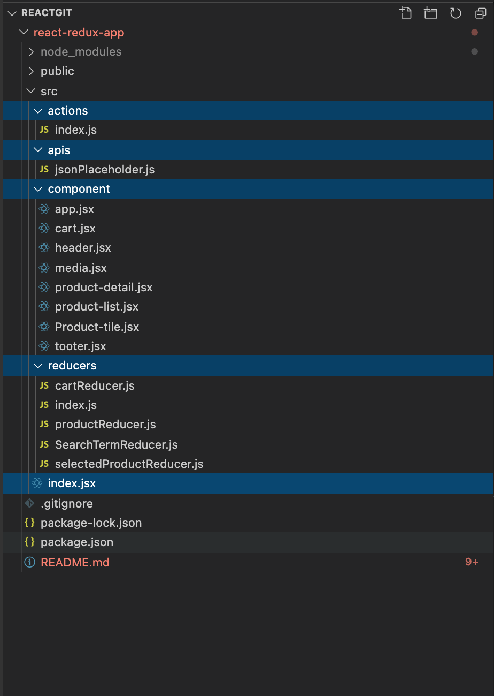

## About Me
- 👋 Hi, I’m @RatanKumar678
- 👀 I’m Front End Developer 
- 🌱 I’m currently working with Globant Inc (Exp: 6 years into UI)
- 💞️ I’m looking to collaborate on Angular/React.
- 📫 How to reach me https://www.linkedin.com/in/ratan-kumar-rebari/

# react-redux-app

## Steps to start App
- Clone to branch from (git clone https://github.com/RatanKumar678/react-redux-app)
- Install Dependence and Dev Dependency ( npm install )
- To Run Project (npm start)
# Git Path
To clone Project (https://github.com/RatanKumar678/react-redux-app)

# Project Description:
Design and implement a production ready application for Furniture shopping App. Based on ReactJS Javascript framework.

## Topics covered In an assignment : 
- Basic React-Redux AppReact component and parent-child communication using Props System.
- State management using React-Redux.
- React-Routing to navigate from product list page to product detail page.
- Axios is a Javascript library used to make HTTP requests.
- Created dummy service and Fetching Product List from API (http://demo6386270.mockable.io/products).
- Used Redux State to maintain Product List, Selected Product, and Cart Data.
- For UI I have created the Custom Style and used React Material UI (MUI).
- Have tried to make Responsiveness.
- Last, not least I have completed my React-Redux certification. 

## Application features:
- Fetching Product list from server and Display Product List Page.
- Clicking on any tile image navigation to Product Detail Page.
- Clicking on any tile add to cart will add an item to Cart List.
- You can search Products from Search Input.Implemented navigation to navigate from List Page to Detail Page.
- Added some more features like Breadcrumb and Snackbar popup.
- Cart will only Store Unique Items and if the item repeats well show count on a particular list.Application Desktop view :

                
